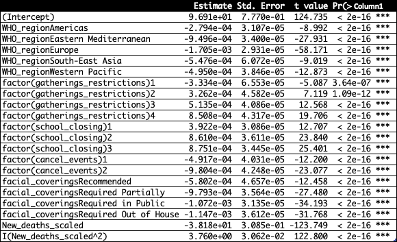

```{r, echo=FALSE}
knitr::opts_chunk$set(echo = FALSE, warning = FALSE, message = FALSE)
```

# Abstract

Throughout the corona virus pandemic, the various measures taken by regional legislatures to "reduce the spread" were often a subject of scrutiny. In this paper, we present an ANCOVA-coded regression model, in order to determine whether there were regional differences in the number of new corona virus cases, and to determine whether various government intervention factors were effective in reducing the number of corona virus cases. The final model yielded an $R^2_{adj}$ value of $46.39\%$, and demonstrated that there were regional differences in the number of corona virus cases relative to population. Additionally, the various government intervention factors had a significant effect on the number of corona virus cases. In general, as the severity of the restrictions increased, the number of new corona virus cases was shown to have increased. Finally, we conclude that causal inference is unfeasible for these data, due to the violations present in the SUTVA assumptions.

# Introduction

For the past two years, the corona virus pandemic has been a subject of vexation. A specific concern that has arisen throughout the pandemic, is whether or not certain geographical areas, are more prone to outbreaks than others, and whether government interventions to reduce corona virus infections were effective. In this paper, we shall utilize Multiple Linear Regression to determine whether or not certain geographical regions were more prone to corona virus outbreaks than others, and whether government efforts to reduce corona virus infections were effective. We then continue to explore the potential differences in the regions and government intervention effects, using techniques such as likelihood ratio tests. Finally, we discuss whether or not causal inference can be made directly on the factors of interest.

# Background

The data of interest, was obtained from the World Health Organization (WHO), and the COVID19 Data Hub. In order to examine whether government intervention (effectively) reduced the number of corona virus cases, we selected four variables representing various forms of government interventions/restrictions. Of interest to us in these variables, are their effects on the number of new cases. Presented below, are these indicator variables, along with a brief description on its contents, and coding:

-   facial_coverings: An indicator variable pertaining to the severity of the facial-covering requirements, for the country of the observation.

    -   Variable Coding:

        -   0 - No policy

        -   1 - Recommended

        -   2 - Required in some public spaces outside the home with other people present, or when social distancing is not possible.

        -   3 - Required in all public spaces, with people present.

        -   4 - Required in all public spaces, regardless if people are present or not.

-   school_closing: An indicator variable pertaining to the severity of the (temporary) shut down of in-person schools.

    -   Variable Coding:

        -   0 - No restrictions.

        -   1 - Recommended.

        -   2 - Required for some grade levels.

        -   3 - Required for all grade levels.

-   gatherings_restrictions: An indicator variable pertaining to the restrictions imposed on public gatherings, for the observation's country.

    -   Variable Coding:

        -   0 - No restrictions

        -   1 - Restrictions for very large gatherings.

        -   2 - Restrictions for large gatherings.

        -   3 - Restrictions for medium-sized gatherings.

        -   4 - Restrictions for small gatherings.

-   cancel_events: An indicator variable pertaining to the restrictions imposed on local events.

    -   Variable Coding:

        -   0 - No restrictions.

        -   1 - Recommended to cancel the event.

        -   2 - Required to cancel the event.

These specific variables were selected among other government restriction indicators, as they were among the most controversial restrictions taken up by various governments. Additionally, the effectiveness of these measures were under constant scrutiny. Next, we utilized the following variables from the WHO's COVID19 - Data bank:

-   WHO_region: The region of the observation's occurrence.

    -   Regions:

        -   Africa

        -   Americas

        -   Europe

        -   South-East Asia

        -   Western Pacific

-   New_cases: The number of newly reported cases.

-   New_deaths: The number of newly reported deaths resulting from corona virus, in the past seven days.

In these data, it is worth noting that there were negative-valued observations in the `New_cases` variable. The reason for this obscurity, is that corrections were submitted into the data, to account for false positive test results. Additionally, there was coding present within the indicator variables, that were coded with a negative sign. These negative codes indicate that it represents a best guess of the policy enforced in the observation's country. For example: a $-1$ in the `cancel_events` column would imply that the observation's country *likely* recommended the cancellation of events.

For the purposes of this paper, we produce an "ANCOVA-styled" multiple regression model, treating the number of `New_cases` as our response variable, with the `WHO_region` , `facial_coverings`, `school_closing`, `gatherings_restrictions`, and `cancel_events` as factors, and the `New_deaths` variable as a covariate. In order to ensure the validity of our results, we will exclude any negative-coded indicator variables present within the data. Additionally, we will remove any correction in the `New_cases` variable, in order to create a more consistent trend.

We argue that it is more efficient to compare each region rather than country, as:

-   Countries within the same region are likely to experience more international travel from its neighboring countries, and could lead to spatial dependencies in the number of corona virus cases.

-   Any model comparing the different regions will have less parameters than a model comparing each individual country, and hence, will result in a lower error variance.

-   Countries within each region are culturally similar; wearing face masks is a common occurrence in the East Asian countries, but is not so in the American countries.

-   For the purposes of model building, if we compare by regions instead of by countries, we reduce the error variability -- leading to increased power for tests of significance.

```{r Data Preprocessing, fig.dim=c(10,10)}
library(tidyverse)
library(plotly)
library(car)
library(lmtest)
library(naniar)
library(waffle)
library(gridExtra)
library(COVID19)
library(MASS)
covid <- read_csv("https://covid19.who.int/WHO-COVID-19-global-data.csv")
covid1 <- covid %>% 
  filter(WHO_region != "Other") %>% mutate(WHO_region = fct_recode(WHO_region, "Eastern Mediterranean"="EMRO",
                                 "Europe" = "EURO",
                                 "Africa" = "AFRO",
                                 "Western Pacific" = "WPRO",
                                 "Americas"="AMRO",
                                 "South-East Asia" = "SEARO")) 
covid1 <- covid1[which(is.na(covid1) == F), ]

covid2 <- COVID19::covid19(verbose = F) 
covid <- left_join(covid1, covid2, by = c("Date_reported" = "date", "Country_code" = "iso_alpha_2")) %>% filter(!is.na(New_cases)) %>% group_by(WHO_region) 

covid[, c(20:32)] <- lapply(covid[, c(20:32)], FUN = factor)
covid <- covid %>% filter(facial_coverings %in% c(0:4)) %>% filter(school_closing %in% c(0:3)) %>% filter(cancel_events %in% c(0:2)) %>% filter(gatherings_restrictions %in% c(0:4)) %>% filter(New_cases >=0)
covid$facial_coverings <- fct_recode(covid$facial_coverings, "No Policy" = '0', "Recommended" = '1', "Required Partially" = '2', "Required in Public" = '3', "Required Out of House" = '4')
```

# Exploratory Data Analysis

To begin, we first conduct some preliminary analysis of the dataset. One aspect of the data that is important to consider, is the number of missing values present. In order to evaluate how many missing values that we may be dealing with, we will utilize the `gg_miss_var` function, from the `naniar` package.

```{r NA Plot, fig.cap= "Figure 1: Missing Values by Variable"}
gg_miss_var(covid[, c("WHO_region", "New_cases", "New_deaths", "facial_coverings", "gatherings_restrictions", "cancel_events", "school_closing")], show_pct = T)
```

Presented from *Figure 1*, is a missing value plot, by variable for our dataset. As evident from the plot above, there are no missing values present within the dataset, after filtering out the negative-valued indicator observations. This will make the process of model building and data analysis easier.

Next, it may be useful to analyze the number of new corona virus cases by region, in order to gain an understanding of how the distribution of new cases differ by region.

```{r Table 1: Cases by Region}
knitr::kable(covid %>% summarise('New_Cases' = sum(New_cases)), caption = "Table 1: Number of New Cases by Region", col.names = c("Region", "New Cases"))
```

Table 1 shows the number of new cases per region (as designated by the World Health Organization). However, while it would be easy to conclude that Europe experienced the most corona virus cases, this summary does not take into account the population residing in each region. To see this, consider a numerical summary, as presented below:

```{r Numerical-Summaries-for-Other-Variables}
summary(covid[, c(4:8)])
```

As evident from the `summary` function, we can see that the majority of the observations in this dataset were from Europe. The region with the least amount of observations in this dataset, was South East Asia. This unbalance in the number of observations per region is to be expected, as we are dealing with observational data. Next, one may notice that the summaries for the `New_cases` and `New_deaths` variables have negative values as their minimum. As stated earlier, the reason behind these negative numbers, is that countries made corrections on the number of corona virus cases on previous days. We can see that on average, there were $1,383$ New cases for a given observation in this dataset. However, the median number of new cases per observation, was only $40$. This implies that the distribution of new cases was heavily skewed right. The most probable reason for this scenario, is due to differences in population between the countries. Large countries such as the United States, or, China, are bound to have a higher population, and hence, a (potentially) higher number of new cases. Therefore, in order to have a more interpretable response variable, we shall standardize each region's number of new cases by their respective populations.

Another potential issue in our response variable, is the number of $0$ values present. For reference to the number 0-valued response observations, consider *Figure 2* below.

```{r Number-of-zeroes-plot, fig.cap="Figure 2: Dotplot of Response Variable Values"}
ggplot(data = covid) + 
  geom_dotplot(aes(x = New_cases)) + 
  xlab("New Cases") + 
  geom_vline(xintercept = 5000, col = 'red', size = 5, alpha = .5)
    
```

As evident from *Figure 2* , $0$ appears to be the mode of the `New_cases` variable. This suggests that zero-inflation may pose a potential issue for modeling the number of new corona virus cases.

\
To re-scale the data, we will utilize the population for each country in a region (as drawn from [The World Data Bank](https://data.worldbank.org/indicator/SP.POP.TOTL)[^1]), and divide each country's number of `New_cases` in a particular region, by the summed population of each country in the region. For the sake of interpretability, we will also multiply these newly-scaled data by a factor of $100,000$. Finally, to make any future transformations on the data easier, we will add to each observation a value of 1, ton ensure that each of the scaled observations will be non-negative.

[^1]: Most countries' populations are based off of data from the year 2020. However, some countries such as Eritrea, haven't conducted an official census as recently, and thus, estimates of the country's population have been replaced with 2011 estimates.

$$
Y_{ij}^{(1)} = \frac{Y_{ij}}{W_J}*100,000  + 5 \\ i \cong \text{Who Region, } j=\{1, 2, ... n_i\}, W_i \cong \text{Population of i'th Who Region} 
$$

```{r Standardizing-Response-Variable}

### Lists of Country by Region
africaNames <-
  c("Algeria","Angola","Benin","Botswana","Burkina Faso","Burundi",
    "Cameroon", "Cape Verde","Central African Republic","Chad", "Comoros",
    "Ivory Coast","Democratic Republic of the Congo", "Equatorial Guinea",
    "Eritrea","Ethiopia", "Gabon", "Gambia",  "Ghana", "Guinea","Guinea-Bissau",
    "Kenya", "Lesotho", "Liberia", "Madagascar", "Malawi", "Mali", "Mauritania",
    "Mauritius", "Mozambique",  "Namibia", "Niger", "Nigeria","Republic of the Congo",
    "Rwanda", "Sao Tome and Principe Africa", "Senegal", "Seychelles", "Sierra Leone",
    "South Africa", "South Sudan",  "Eswatini", "Togo", "Uganda", "Tanzania", "Zambia",
    "Zimbabwe")

americasNames <-
  c("Antigua and Barbuda", "Argentina","Bahamas","Barbados","Belize","Bolivia",
    "Brazil","Canada","Chile","Colombia", "Costa Rica", "Cuba","Dominica",
    "Dominican Republic", "Ecuador","El Salvador","Grenada","Guatemala","Guyana","Haiti",
    "Honduras", "Jamaica", "Mexico", "Nicaragua", "Panama", "Paraguay", "Peru",
    "Saint Kitts and Nevis", "Saint Lucia", "Saint Vincent and the Grenadines","Suriname",
    "Trinidad and Tobago","United States","Uruguay","Venezuela"  )

eastMedNames <-
  c("Afghanistan","Bahrain","Djibouti", "Egypt", "Iran", "Iraq", "Jordan", "Kuwait", 
    "Lebanon", "Libya","Morocco", "Oman", "Pakistan", "Palestine", "Qatar", "Saudi Arabia",
    "Somalia","Sudan","Syria","Tunisia","United Arab Emirates", "Yemen")

europeNames <-
  c("Albania","Andorra","Armenia","Austria","Azerbaijan","Belarus","Belgium",
    "Bosnia and Herzegovina","Bulgaria","Croatia","Cyprus","Czech Republic","Denmark",
    "Estonia","Finland","France", "Georgia","Germany","Greece",'Hungary',"Iceland", 
    "Ireland","Israel", "Italy", "Kazakhstan","Kyrgyzstan","Latvia",'Lithuania','Luxembourg',
    'Malta','Moldova','Monaco','Montenegro','Netherlands','North Macedonia','Norway',
    'Poland','Portugal','Romania','Russia', 'San Marino', 'Serbia', 'Slovakia','Slovenia',
    'Spain','Sweden','Switzerland','Tajikistan','Turkey','Turkmenistan','Ukraine',
    'United Kingdom','Uzbekistan')

soeastAsiaNames <-
  c("Bangladesh","Bhutan","North Korea","India","Indonesia","Maldives","Myanmar","Nepal",
    "Sri Lanka","Thailand","Timor-Leste")


westPacificNames <-
  c('Australia','Brunei','Cambodia','China','Cook Islands','Fiji','Japan','Kiribati','Laos',
    'Malaysia', 'Marshall Islands','Micronesia','Mongolia','Nauru','New Zealand','Niue',
    'Palau','Papua New Guinea','Philippines','Samoa','Singapore','Solomon Islands',
    'South Korea','Tonga','Tuvalu','Vanuatu','Vietnam')

### Population by Region

popByCountry <- read_csv("popData.csv", skip = 4)
popByCountry[which(popByCountry$`Country Name` == "Eritrea"), 5] <-
  population[1243, 3]

africaPop <-
  filter(popByCountry, `Country Name` %in% africaNames) %>% summarise("population" = sum(`2020`, na.rm = T))

americaspop <-
  filter(popByCountry, `Country Name` %in% americasNames) %>% summarise("population" = sum(`2020`, na.rm = T))

eastMedpop <-
  filter(popByCountry, `Country Name` %in% eastMedNames) %>% summarise("population" = sum(`2020`, na.rm = T))

europepop <-
  filter(popByCountry, `Country Name` %in% europeNames) %>% summarise("population" = sum(`2020`, na.rm = T))

soeastAsiapop <-
  filter(popByCountry, `Country Name` %in% soeastAsiaNames) %>% summarise("population" = sum(`2020`, na.rm = T))

westPacificpop <-
  filter(popByCountry, `Country Name` %in% westPacificNames) %>% summarise("population" = sum(`2020`, na.rm = T))

### Making Number of New Cases scaled by Population

for (i in 1:nrow(covid)) {
  covid$New_cases_scaled[i] <- if (covid$WHO_region[i] == "Africa") {
    covid$New_cases[i] / africaPop$population
  } else if (covid$WHO_region[i] == "Americas") {
    covid$New_cases[i] / americaspop$population
  } else if (covid$WHO_region[i] == "Eastern Mediterranean") {
    covid$New_cases[i] / eastMedpop$population
  } else if (covid$WHO_region[i] == "Europe") {
    covid$New_cases[i] / europepop$population
  } else if (covid$WHO_region[i] == "South-East Asia") {
    covid$New_cases[i] / soeastAsiapop$population
  } else {
    covid$New_cases[i] / westPacificpop$population
  }
  
}

### Making Number of New Deaths Scaled by Population

for (i in 1:nrow(covid)) {
  covid$New_deaths_scaled[i] <- if (covid$WHO_region[i] == "Africa") {
    covid$New_deaths[i] / africaPop$population
  } else if (covid$WHO_region[i] == "Americas") {
    covid$New_deaths[i] / americaspop$population
  } else if (covid$WHO_region[i] == "Eastern Mediterranean") {
    covid$New_deaths[i] / eastMedpop$population
  } else if (covid$WHO_region[i] == "Europe") {
    covid$New_deaths[i] / europepop$population
  } else if (covid$WHO_region[i] == "South-East Asia") {
    covid$New_deaths[i] / soeastAsiapop$population
  } else {
    covid$New_deaths[i] / westPacificpop$population
  }
  
}

### Final Scalings

covid$New_cases_scaled <- covid$New_cases_scaled * 100000 + 5
covid$New_deaths_scaled <- covid$New_deaths_scaled * 100000 + 5

knitr::kable(
  covid %>% group_by(WHO_region) %>% summarise('New Cases' = sum(New_cases_scaled)),
  caption = "Table 2: Number of (Scaled) New Cases by Region",
  col.names = c("Region", "New Cases (Scaled)")
)

```

As evident from Table 2, we can see that there are obvious differences in the (scaled) number of new cases between the regions. For instance --- Europe and Africa have a much higher (scaled) number of new cases, than the other regions. A comparison in the (scaled) number of corona virus cases by region will be conducted via a statistical approach in the results section.

We will now proceed to determine the distribution of mask mandates, by `WHO_region`, as presented in the waffle charts below.

```{r Facial-Covering-Percentage, fig.dim=c(10,10), fig.cap="Figure 3: Waffle Chart for Proportions of Mask Mandates by Region"}
waffleVizAfr <-
  covid %>% filter(WHO_region == 'Africa') %>% group_by(facial_coverings) %>% summarise("count" = n()) %>% pull(name = facial_coverings) /
  1000

waffleVizAmer <-
  covid %>% filter(WHO_region == 'Americas') %>% group_by(facial_coverings) %>% summarise("count" = n()) %>% pull(name = facial_coverings) /
  1000

waffleVizEMed <-
  covid %>% filter(WHO_region == 'Eastern Mediterranean') %>% group_by(facial_coverings) %>% summarise("count" = n()) %>% pull(name = facial_coverings) /
  1000

waffleVizEuro <-
  covid %>% filter(WHO_region == 'Europe') %>% group_by(facial_coverings) %>% summarise("count" = n()) %>% pull(name = facial_coverings) /
  1000

waffleVizSAsia <-
  covid %>% filter(WHO_region == 'South-East Asia') %>% group_by(facial_coverings) %>% summarise("count" = n()) %>% pull(name = facial_coverings) /
  1000

waffleVizWPac <-
  covid %>% filter(WHO_region == 'Western Pacific') %>% group_by(facial_coverings) %>% summarise("count" = n()) %>% pull(name = facial_coverings) /
  1000

w1 <- waffle(parts = waffleVizAfr, rows = 5) +
  xlab("Africa") +
  scale_fill_brewer(
    palette = 'Dark2',
    name = "Mask Policly",
    labels = c(
      "No Policy",
      "Recommened",
      "Required in Some Public Areas",
      "Required in All Public Areas",
      "Required Outside of Home"
    )
  )

w2 <- waffle(parts = waffleVizAmer, rows = 5) +
  xlab("Americas") +
  scale_fill_brewer(
    palette = 'Dark2',
    name = "Mask Policly",
    labels = c(
      "No Policy",
      "Recommened",
      "Required in Some Public Areas",
      "Required in All Public Areas",
      "Required Outside of Home"
    )
  )

w3 <- waffle(parts = waffleVizEuro, rows = 5) +
  xlab("Europe") +
  scale_fill_brewer(
    palette = 'Dark2',
    name = "Mask Policly",
    labels = c(
      "No Policy",
      "Recommened",
      "Required in Some Public Areas",
      "Required in All Public Areas",
      "Required Outside of Home"
    )
  )

w4 <- waffle(parts = waffleVizSAsia, rows = 5) +
  xlab("South East Asia") +
  scale_fill_brewer(
    palette = 'Dark2',
    name = "Mask Policly",
    labels = c(
      "No Policy",
      "Recommened",
      "Required in Some Public Areas",
      "Required in All Public Areas",
      "Required Outside of Home"
    )
  )

w5 <- waffle(parts = waffleVizWPac, rows = 5) +
  scale_fill_brewer(
    palette = 'Dark2',
    name = "Mask Policly",
    labels = c(
      "No Policy",
      "Recommened",
      "Required in Some Public Areas",
      "Required in All Public Areas",
      "Required Outside of Home"
    )
  ) +
  xlab("West Paific")

grid.arrange(w1, w2, w3, w4, w5, nrow = 3) 
```

As evident from *Figure 3*, the differing regions had differences in their respective mask requirements. For Africa, it was most common for countries to require masks in all public spaces. For Europe, most countries required masks in public areas to an extent. For the Americas, most countries required masks in public areas. For the West Pacific, most countries either had no policy. Finally, the majority of South-East Asia required masks in some public areas.

Next, we shall analyze the distribution of our response variable: the (scaled) number of new cases, using a violin plot.

```{r Violin-Plot-of-Response-by-Region, fig.cap="Figure 4: Violin Plot of (Scaled) New Cases by Region"}
covid %>% 
  filter(Date_reported>= "2021-01-03", Date_reported<= "2022-03-01") %>% 
  group_by(WHO_region) %>%
  plot_ly(
    x= ~New_cases_scaled,
    text=~WHO_region,
    hoverinfo="WHO_region",
    color=~WHO_region,
    type = 'violin',
    showlegend = T
  )
```

As evident from *Figure 4*, it appears that there are minor differences in the number of new cases, between the different regions. This suggests that it would be worth including `Who_region` as a factor in our regression model. Additionally, it is evident that these distributions are extremely right skewed, with multiple, notable, outliers.

Next, we shall analyze the case mortality rate, by region. According to the Center for Disease Control (CDC), the case mortality for a given region can be defined as the number of deaths caused by the disease, divided by the total number of cases. Presented in Table 3 below, is the case mortality rate for each WHO-designated region. These rates were calculated by taking the average of the ratio of cumulative deaths and cumulative cases, within each region.

```{r Case-Fatality-Rate, fig.cap="Table 3: (Averaged) Case Mortality Rate by WHO Region"}
covid %>% filter(Date_reported >= "2022-01-01") %>% group_by(WHO_region) %>% summarise("Case Mortality Rate" = mean(Cumulative_deaths/Cumulative_cases, na.rm = T))

```
As evident from *Table 3*, most of the case-mortality rates appeared to be around 1%. However, the Eastern Mediterranean region had a case-mortality rate of around 3% -- around double that of the other regions. Additionally, we can see that the Western Pacific had a much lower mortality rate than the other WHO regions. A possible reason for these differences in the case mortality rates, are that different regions may not have as many testing resources as others; Regions that contain more impoverished countries, may not have the same testing capabilities as regions with wealthier countries.

Next, we shall analyze how the number of cases has changed through time, using a time-series plot. Presented in *Figure 5* , is a LOESS-smoothed plot, of the number of new corona virus cases, throughout the pandemic. Each separate line, represents the number of cases for a different region.

```{r time-series-plot, fig.cap="Figure 5: LOESS Smoothed Number of Cases over Time"}
covid %>% filter(New_cases > 0) %>% 
  ggplot() + 
  geom_smooth(aes(x = Date_reported, y = New_cases, color = WHO_region))
```

As evident from the LOESS-smoothed time series plot, we can see that in the beginning of the corona virus pandemic, most WHO designated regions experienced similar patterns in the number of corona virus cases. However, starting around 2021, the number of corona virus cases appeared to have change relative to their respective regions of occurrence. For instance: in 2021, Europe showed a significant increase in the number of corona virus cases. More recently, we can see that the Western-Pacific region has experienced a dramatic increase in the number of corona virus cases.

Next, we will view the distribution of the number of new cases, with respect to the different facial covering restrictions.

```{r Violin-Plot-of-Response-by-facial_coverings, fig.cap="Figure 6: Violin Plot of (Scaled) New Cases by Facial Covering Restrictions"}
covid %>% 
  filter(Date_reported>= "2021-01-03", Date_reported<= "2022-03-01") %>% 
  group_by(facial_coverings) %>%
  plot_ly(
    x= ~New_cases_scaled,
    text=~facial_coverings,
    hoverinfo="facial_coverings",
    color=~facial_coverings,
    type = 'violin',
    showlegend = T
  )
```

As presented in the *Figure 6*, there appears to be differences in the distributions of new cases by facial covering restrictions. Additionally, it appears that the variance between the distributions differ significantly -- which may present a potential issue when fitting our model. Again, it appears that these conditional distributions are severely right-skewed. Next, we will analyze the distribution of the number of new cases with respect to the different gathering restrictions.

```{r Violin Plot of Response by gatherings_restrictions, fig.cap="Figure 7: Violin Plot of (Scaled) New Cases by Gathering Restrictions"}
covid %>% 
  filter(Date_reported>= "2021-01-03", Date_reported<= "2022-03-01") %>% 
  group_by(gatherings_restrictions) %>%
  plot_ly(
    x= ~New_cases_scaled,
    text=~gatherings_restrictions,
    hoverinfo="gatherings_restrictions",
    color=~gatherings_restrictions,
    type = 'violin',
    showlegend = T
  )
```

As evident from *Figure 7*, these conditional distributions do not appear to share a similar variance. This may as well, pose a potential issue when fitting our model. Additionally, there does not appear to be much of a difference between the number of new cases, with respect to the gathering restrictions.

```{r Violin Plot of Response by schools_closing, fig.cap="Figure 8: Violin Plot of (Scaled) New Cases by School Closure Levels"}
covid %>% 
  filter(Date_reported>= "2021-01-03", Date_reported<= "2022-03-01") %>% 
  group_by(school_closing) %>%
  plot_ly(
    x= ~New_cases_scaled,
    text=~school_closing,
    hoverinfo="school_closing",
    color=~school_closing,
    type = 'violin',
    showlegend = T
  )
```

As evident from *Figure 8*, the conditional distributions, again, appear to have different variances. Additionally, there do not appear to be any significant differences between the different school closure restrictions. Next, we shall analyze the distribution of the new corona virus cases with respect to the varying event restrictions.

```{r Violin Plot of Response by cancel_events, fig.cap="Figure 9: Violin Plot of (Scaled) New Cases by Event Cancellation Severity"}
covid %>% 
  filter(Date_reported>= "2021-01-03", Date_reported<= "2022-03-01") %>% 
  group_by(cancel_events) %>%
  plot_ly(
    x= ~New_cases_scaled,
    text=~cancel_events,
    hoverinfo="cancel_events",
    color=~school_closing,
    type = 'violin',
    showlegend = T
  )
```

As evident from the violin plots presented in *Figure 9*, these conditional distributions, again, appear to differ in variance. This suggests that a transformation may be needed to coerce the response variable into the homoskedasticity assumption.

Finally, we analyze the relationship between the (scaled) number of new_deaths, with the (scaled) number of new cases.

```{r Scatterplot, fig.cap="Figure 10: Scatterplot of New Deaths vs. New Cases"}
ggplot(data = covid, aes(x = New_deaths_scaled, y = New_cases_scaled)) + 
  geom_point(color = 'blue') 
```

Contrary to our intuition, there does not appear to be a clear, linear relationship between the (scaled) number of new deaths, and the (scaled) number of new cases. As a result, we shall attempt to fit a second-order term in our model-building process, in an effort to capture the relationship between `New_deaths_scaled` and `New_cases_scaled`. With this background information of the data in mind, we shall begin to produce our preliminary fit.

# Regression Model

## Preliminary Fit

The purpose of this preliminary fit, is to gain inference on whether the variables selected (see *Background*) were significant in determining the number of new corona viruses cases. We now fit a simple, multiple regression model with all of the factors of interest, using the `lm` function from `base`.

$$
Y_i = \beta_0 + \beta_1X_{1i} + \beta_2X_{2i} + \beta_3X_{3i} + \beta_4X_{4i} + \beta_5X_{5i} + \beta_6X_{6i} +\epsilon_i \\ i = 1,2,...101,893, \text{  Where } \epsilon \stackrel{i.i.d.}{\sim} Normal(0, \sigma^2), \text{ and:} \\ X_1 = \text{WHO_region, } X_2 = \text{gathering_restrictions, } \\ X_3 = \text{school_closing, } X_4 = \text{cancel_events, }X_5 = \text{facial_coverings, and } X_6 = \text{New_deaths_scaled}
$$

```{r}
prelimFit <- lm(New_cases_scaled ~ WHO_region + factor(gatherings_restrictions) + factor(school_closing) + factor(cancel_events) + facial_coverings + New_deaths_scaled, data = covid)
summary(prelimFit)
```

From the `summary` function output, we can see that every term in the model was significantly different from 0. However, the value of the $R^2_{adj}$ is very low, suggesting that not much variability was explained by the model. To diagnose the potential issues, we shall utilize a residual a QQ-plot, and the Cook's Distance Criteria. We set the threshold, that if a residual obtains a Cook's distance of 0.1, or greater, then it will be considered an influential point.

### Residual Analysis

```{r fig.cap="Figure 11: Residual Plots for Preliminary Fit"}
par(mfrow = c(2,2))
plot(prelimFit, which = 1)
plot(prelimFit, which = 2)
plot(prelimFit, which = 4)
plot(prelimFit, which = 5)
```

As evident from the residual plot in *Figure 11*, the homoskedasticity assumption of the regression, appears to be violated. A fan effect is demonstrated in the residual plot, along with a few notable outliers. There also appears to be a slight curvature to the residuals. This suggests that a transformation may be needed to coerce the response variable into meeting the necessary assumptions. Additionally, we can see from the normality plot that the distribution is very right skewed. Next, we can see that there were a few outliers such as observation $27427$[^2], which had a Cook's Distance of around 8 --- indicating it to be a highly influential point. Before we move onto our next fit, we shall utilize the *Box-Cox* method, in order to find a suitable transformation for the data. Additionally, we shall remove all influential points -- points with a Cook's distance greater than 0.1.

[^2]: This observation was from Ecuador, on July 21 2021. I attempted to research the cause behind this extreme observation, but there were no news articles containing information on coronavirus in Ecuador, circa July, 2021.

```{r}
index <- which(cooks.distance(prelimFit) > 0.1)
if (sum(index) != 0 ){
  covid_outlier_free <- covid[c(-index, -27427), ]
} else {
  covid_outlier_free <- covid
}
```

## Transformation

```{r fig.cap="Figure 12: Box-Cox Transformation Plot"}
boxcox(prelimFit)
```

According to the Box-Cox transformation method, the best suited transformation of the response variable is $Y^{-2}$. Next, we will implement the transformation on our model, with the high influential points removed.

## Initial Fit

For our next model, we will take the advice of the *Box-Cox* procedure, and transform our response variable accordingly. Additionally, we shall include a second-order term for the `New_deaths_scaled` variable. We anticipate that the second-order term will be able to capture the curvature presented in *Figure 10*, earlier. Additionally, we will remove all the observations that had a *Cook's Distance* measurement of $0.1$ or greater.

$$
(Y_i)^{-2} = \beta_0 + \beta_1X_{1i} + \beta_2X_{2i} + \beta_3X_{3i} + \beta_4X_{4i} \\  + \beta_5X_{5i} + \beta_6X_{6i} + \beta_7X_{7i} + \epsilon_i \\ i = 1,2,...101,893, \text{  Where } \epsilon \stackrel{i.i.d.}{\sim} Normal(0, \sigma^2), \text{ and:} \\ X_1 = \text{WHO_region, } X_2 = \text{gathering_restrictions, } \\ X_3 = \text{school_closing, } X_4 = \text{cancel_events, }X_5 = \text{facial_coverings, }\\ X_6 = \text{New_deaths_scaled, and } X_7 = \text{New_deaths_scaled}^2
$$

```{r}
fit1 <- lm((New_cases_scaled)^(-2) ~ WHO_region + factor(gatherings_restrictions) + factor(school_closing) + factor(cancel_events) + facial_coverings + New_deaths_scaled + I(New_deaths_scaled^2), data = covid_outlier_free)
summary(fit1)
```

As evident from the `summary` output, we can see that every term in the model is statistically significant. Additionally, we can see that the value of the $R^2_{adj}$ has increased to .4515. With this improvement in the model, we shall now turn to residual analysis in order to ensure that our model assumptions have been met.

### Residual Analysis

```{r fig.cap= "Figure 13: Residual Plots for Fit 1"}
par(mfrow = c(2,2))
plot(fit1, which = 1)
plot(fit1, which = 2)
plot(fit1, which = 4)
plot(fit1, which = 5)
index <- which(cooks.distance(fit1) > 0.1) ### To determine Influential Points
covid_without_residuals <- covid_outlier_free[c(-index), ]
```

As evident from the residual plot, there appears to be multiple outliers present. Of particular concern, is observation $47676$. The homoskedasticity assumption appears to have been slightly improved but still violated. Additionally, we can see that the normality assumption of the data has improved, but still deviates slightly along the more extreme theoretical quantiles. Next, from the *Cook's Distance* plots, we can see that there were two largely influential points: observations $47676$[^3], and $33909$[^4]. In hopes of improving the homoskedasticity and the normality assumptions, we shall remove these observations, and refit the model.

[^3]: This observation was from Kazahkstan, on March 22, 2021.

[^4]: This observation was from France, on April 4, 2020. The reason this observation had such an extreme number of new cases, was due to the initial corona virus outbreak in Europe.

## Final Fit[^5]

[^5]: Numerous models, in the family of general linear models, quantile regression, and IRWLS regression were attempted to fit this dataset. The model presented here, yielded the "best-behaved" residuals.

```{r}
fit2 <- lm((New_cases_scaled)^(-2) ~ WHO_region + factor(gatherings_restrictions) + factor(school_closing) + factor(cancel_events) + facial_coverings + New_deaths_scaled + I(New_deaths_scaled^2), data = covid_without_residuals)
summary(fit2)
```

```{r, fig.cap="Figure 14: Residual Plots for Second Fit"}
par(mfrow = c(2,2))
plot(fit2, which = 1)
plot(fit2, which = 2)
plot(fit2, which = 4)
plot(fit2, which = 5) 
```

As evident from the residual plots, there are still violations of the homoskedasticity and normality assumptions. Additionally, more influential points have appeared as a result of the refitting. Therefore, we shall refit the model with these influential points removed.

```{r}
index <- which(cooks.distance(fit2) > .1)
covid_without_residuals <- covid_without_residuals[c(-index), ]
fit3 <- lm((New_cases_scaled)^(-2) ~ WHO_region + factor(gatherings_restrictions) + factor(school_closing) + factor(cancel_events) + facial_coverings + New_deaths_scaled + I(New_deaths_scaled^2), data = covid_without_residuals)
summary(fit3)
```

As evident from `summary` output, we can see that the $R^2_{adj}$ has increased to a value of 46.39%. Additionally, we can see that every term in the model was significantly different from 0. Although it may be tempting to utilize the hypothesis tests presented in the `summary` output, we must analyze the residual plots in order to determine whether the assumptions of the hypothesis tests have been met.

```{r, fig.cap="Figure 15: Residual Plots for Final Fit"}
par(mfrow = c(2,2))
plot(fit3, which = 1)
plot(fit3, which = 2)
plot(fit3, which = 4)
plot(fit3, which = 5) 
```

As evident from the "brick-like" pattern in the residual plot, it appears that the homoskedasticity assumption may still be violated. However, when noticing how small the spread of the residuals is (within $\stackrel{+}{-} .04$ of $0$), I believe that the violation in the homoskedasticity assumption is not too extreme. Therefore, I would argue that we can be lenient with this assumption. Additionally, the QQ-plot of the residuals suggests that the normality assumption of the model may have been violated. However. due to the large sample size of this dataset, I believe that we may be more lenient with these assumptions. According to Schmidt (2018), the regression model is robust with respect to departures in the normality assumption, for large sample sizes. As we have around $100,000$ observations used in our regression model, our regression model should be resilient to the residuals' departure from normality.

### Testing Results from Model

*Note: The methods utilized in this section, assume that the homoskedasticity assumption has been met. As argued above, since the majority of the residuals consistently fall within a range of .04 of 0, it is argued that we can be lenient with the homoskedasticity violation.*

#### Likelihood Ratio Test

In order to test whether government intervention had a significant effect on the number of corona virus cases, we will utilize a likelihood ratio test. As our normality assumption may be violated, we must use an alternative to the F-test. However, as we have a large sample size, we should be able to approximate a p-value, utilizing the fact the asymptotically, the LRT statistic follows a $\chi^2$ distribution.

$$H_0: \text{At None of the Government Intervention Factors had a Significant Effect on the Number of New Cases} \\ 
H_1: \text{At Least one of the Government Intrvention Factos had a Significant Effect on the Number of New Cases}$$

```{r LRT-Conclusions}
null_model <- lm((New_cases_scaled)^(-2) ~ WHO_region, data = covid_without_residuals)
lrtest(fit3, null_model)
```

As evident from the results of the likelihood ratio test, we can conclude that at least one of the government intervention variables had a significant effect on the number of corona virus cases.

#### Effects of Each Parameter

Now that we have successfully determined that at least one of the government intervention variables had a significant effect on the number of cases, we shall now utilize the estimated coefficients of the parameters of interest, as well as their respective t-tests, in an attempt to determine what effect the government intervention had on the number of new cases.



Table 4: Estimates for Coefficients in Final Model

As evident from Table 4 we can see that each of the WHO regions differed in the number of (scaled) corona virus cases. For the `gatherings_restrictions` levels, we can see that as the severity of the restrictions increased, the larger the transformed response grew. As we enacted a $Y^{(-2)}$ transformation, this implies that increasing the severity of the `gatherings_restrictions` (while holding all other factors constant) resulted in an increase of corona virus cases --- which is very counter-intuitive. However, as we can define our original response, $Y'$ as: $Y' = 1/\sqrt(Y)$ , this implies that there would be more corona virus cases, with the less severe options of `gatherings`. The same results can be observed for the `school_closing` factor as well.

Based off of the estimates for the `facial_coverings` coefficients, we can see that requiring facial coverings partially was associated with higher corona virus cases, than the other facial covering restrictions (when holding other predictors fixed). In contrast, requiring facial coverings in public (although associated with an increase in corona virus cases) resulted in the smallest increase in corona virus cases (while holding other predictors fixed).

Based off of the estimates for the `WHO_region` coefficients, we can see that when an observation came from Europe, it was associated with more corona virus cases than the other WHO designated regions. Additionally, when the observation came from the Eastern Mediterranean, it would results in less corona virus cases than if the observation came from another region (while holding all other factors fixed).

# A Note on Causal Inference

In this dataset, causal inference is not feasible. The reason we are unable to conduct causal inference in this scenario, is that the Stable Unit Treatment Value Assumptions (SUTVA) have been violated. One of the most demonstrative violations of the SUTVA, lies in the `facial_covering` variable. Some people have utilized N95 masks as face coverings throughout the pandemic, while others have opted for less- protective options, such as *Face Shields* or neck-gaiters. Since this treatment is tailored to each individuals personal preferences, we cannot make causal inference. Additionally, we cannot utilize the ignorability assumption, as there are no covariates for which we can assume that the assignment of our factors are conditionally independent of the potential outcomes. Therefore, we are left to suffer the drawbacks associated with a lack of randomization.

# Conclusion

Overall, when deciding to be lenient with the homoskedasticity assumption, we can conclude that the government intervention factors had a significant effect on the number of new corona virus cases. Additionally, we can conclude that there were, in fact, differences in the number of new corona virus cases, with respect to region. (even when taking population into account). However, we must take caution when making these conclusions; as our model seemingly violated the assumption of homoskedasticity for the error term, our results may be confounded. An additional drawback associated with this analysis, is the unequal representation of different regions in this dataset. As shown in our *Exploratory Data Analysis*, most of the observations came from Europe. This leaves the possibility of sampling bias within our results. However, due to an overall large sample size, containing large subsamples from each region, I believe that this analysis will be resilient to both the sampling bias, as well as the heteroskedasticity assumption present within our residuals.

# References

Amand F. Schmidt, Chris Finan, Linear regression and the normality assumption, Journal of Clinical Epidemiology, Volume 98, 2018, Pages 146-151, ISSN 0895-4356,

Centers for Disease Control and Prevention. (2016, March 8). *Case fatality ratios*. Centers for Disease Control and Prevention. Retrieved March 11, 2022, from <https://www.cdc.gov/foodnet/reports/data/case-fatality.html>

Ritchie, H., Mathieu, E., Rodés-Guirao, L., Appel, C., Giattino, C., Ortiz-Ospina, E., Hasell, J., Macdonald, B., Beltekian, D., & Roser, M. (2020, March 5). *Coronavirus (COVID-19) testing*. Our World in Data. Retrieved March 11, 2022, from <https://ourworldindata.org/coronavirus-testing>

*Population, total*. Data. (n.d.). Retrieved March 11, 2022, from <https://data.worldbank.org/indicator/SP.POP.TOTL>

Wikimedia Foundation. (2022, February 6). *Demographics of eritrea*. Wikipedia. Retrieved March 11, 2022, from <https://en.wikipedia.org/wiki/Demographics_of_Eritrea>

World Health Organization. (n.d.). World Health Organization. Retrieved March 11, 2022, from <https://covid19.who.int/info>

Wickham et al., (2019). Welcome to the tidyverse. Journal of Open Source Software, 4(43), 1686, https://doi.org/10.21105/joss.01686

C. Sievert. Interactive Web-Based Data Visualization with R, plotly, and shiny. Chapman and Hall/CRC Florida, 2020.

Achim Zeileis, Torsten Hothorn (2002). Diagnostic Checking in Regression Relationships. R News 2(3), 7-10. URL https://CRAN.R-project.org/doc/Rnews/

Bob Rudis and Dave Gandy (2017). waffle: Create Waffle Chart Visualizations in R. R package version 0.7.0. https://CRAN.R-project.org/package=waffle

Baptiste Auguie (2017). gridExtra: Miscellaneous Functions for "Grid" Graphics. R package version 2.3.
https://CRAN.R-project.org/package=gridExtra

Guidotti, E., Ardia, D., (2020), "COVID-19 Data Hub", Journal of Open Source Software 5(51):2376, doi: 10.21105/joss.02376.

Venables, W. N. & Ripley, B. D. (2002) Modern Applied Statistics with S. Fourth Edition. Springer, New York. ISBN 0-387-95457-0

Nicholas Tierney, Di Cook, Miles McBain and Colin Fay (2021). naniar: Data Structures, Summaries, and Visualisations for Missing Data. R
package version 0.6.1. https://CRAN.R-project.org/package=naniar

R Core Team (2021). R: A language and environment for statistical computing. R Foundation for Statistical Computing, Vienna, Austria. URL
https://www.R-project.org/.
